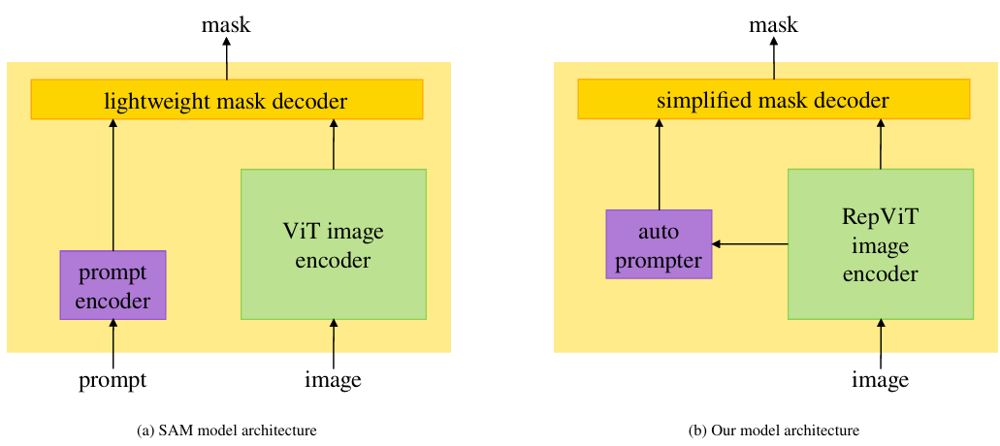
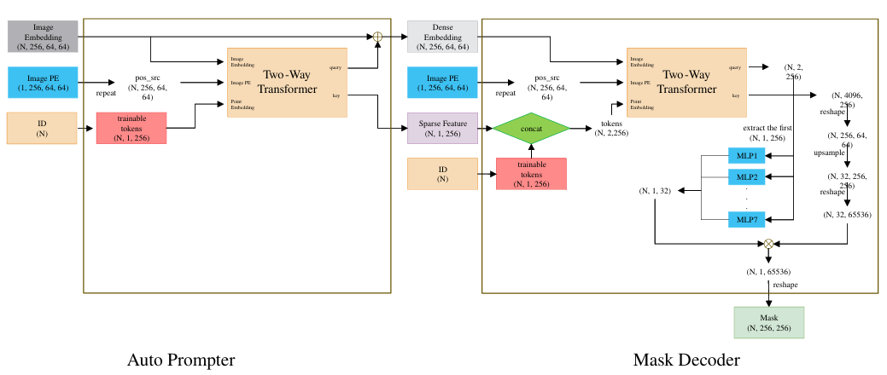
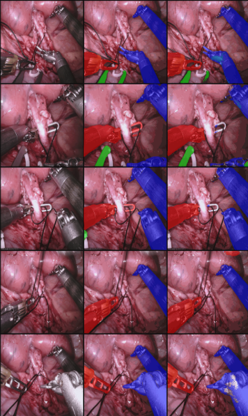
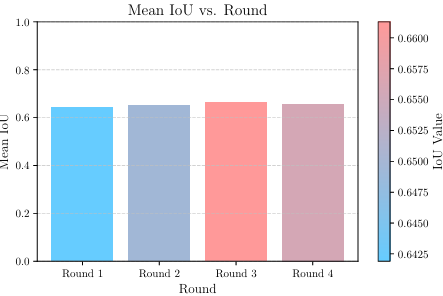
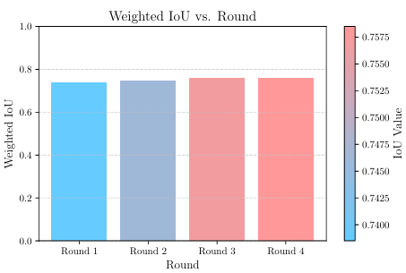

# Surgical Tool Recognition and Segmentation Based on Enhanced SAM

This repository provides a lightweight SAM-based framework for surgical tool recognition and segmentation in endoscopic images. The model combines a RepViT image encoder, an auto-prompter, and a SAM-style mask decoder to jointly predict surgical tool categories and class-specific segmentation masks.

本仓库是课程项目报告 **Surgical Tool Recognition and Segmentation Based on Enhanced SAM** 的代码实现，为上海交通大学计算机视觉课程项目。项目面向机器人辅助手术场景，将手术器械分类识别与像素级分割统一到一个轻量级 SAM-based 框架中，用于在内窥镜图像中同时判断器械类别并生成对应分割掩码。

## Quick Start

```bash
git clone https://github.com/Jason-zzh/Surgical-Tool-Recognition-and-Segmentation-based-on-enhanced-SAM.git
cd Surgical-Tool-Recognition-and-Segmentation-based-on-enhanced-SAM

pip install -r requirements.txt

python train_sam_endo18_rep.py
python eval_sam_endo18_rep.py
```

> PyTorch should be installed according to your CUDA version if the default `pip` installation is not suitable for your environment.

## Project Overview

原始 SAM 依赖较重的 ViT 图像编码器和人工 prompt，不适合对实时性要求较高的微创手术场景。本项目使用 RepViT 替换 ViT 编码器，并引入 prompt-free 的 auto-prompter 与简化 mask decoder，使模型能够在无人工 prompt 的情况下完成器械类别相关的分割预测。

课程项目报告中的主要设计包括：

- **Lightweight Architecture**: 使用 RepViT-based image encoder 降低计算开销，同时保留空间细节。
- **Prompt-Free Multi-Task Design**: 使用 auto-prompter 生成 dense / sparse embeddings，去除手工 prompt 依赖。
- **Joint Classification and Segmentation**: 通过类别条件 token 将器械类别识别与对应 mask 预测绑定到同一次前向传播中。
- **Pseudo-Labeling Training**: 通过多轮伪标签扩充训练集，缓解医学数据中的类别不均衡问题。

## Features

- 使用 RepViT 作为轻量级视觉特征提取器。
- 使用类条件 token 引导的 MaskFormer / MaskDecoder 结构，同时完成器械类别识别与对应类别的掩码生成。
- 支持 7 类手术器械分类与分割训练，并输出逐类 IoU 评估结果。
- 训练过程自动保存 RepViT、特征模块和掩码解码器三部分 checkpoint。
- 评估脚本按 epoch 输出 Mean IoU 与各类别 IoU。

## Demo

将图片或动图放入 `assets/` 目录后，GitHub README 会直接渲染下列内容。

### Model Architecture



### Auto Prompter / Mask Decoder



### Segmentation Results



### IoU Results





### Result GIF


## Project Structure

```text
.
├── README.md
├── LICENSE
├── requirements.txt
├── train_sam_endo18_rep.py
├── eval_sam_endo18_rep.py
├── rep_vit/
│   ├── common.py
│   └── rep_vit.py
└── assets/
    ├── model_architecture.png
    ├── auto_prompter_mask_decoder.png
    ├── segmentation_results.png
    ├── mean_iou_result.png
    ├── weighted_iou_result.png
    └── result_demo.gif
```

## Method Overview

本项目将手术图像 resize 到 `1024 x 1024` 后输入 RepViT，得到 `256` 通道的图像特征。模型不仅预测目标区域，还会根据类别 id 选择对应的类别 token，从而将“识别是哪一种手术器械”和“分割该器械所在区域”绑定到同一次前向过程中。

整体流程如下：

1. `FeatModel` 使用类条件 mask token 和 two-way transformer，将 RepViT 特征转换为 sparse / dense embeddings。
2. `Model` 中的 `MaskDecoder` 根据器械类别 id 选择对应 mask token 与 hypernetwork。
3. 解码器输出该类别对应的 `256 x 256` 分割 logits。
4. 训练阶段使用 sigmoid 后的二值交叉熵损失。
5. 评估阶段以阈值 `0.5` 得到预测 mask，并计算各类别 IoU 与平均 IoU。

当前代码中的 7 个类别目录为：

```text
BF, CA, LND, MCS, PF, SI, UP
```

对应课程项目报告中的 EndoVis18 类别为：

| Abbr. | Class |
| --- | --- |
| BF | Bipolar Forceps |
| CA | Clip Appliers |
| LND | Large Needle Driver |
| MCS | Monopolar Curved Scissors |
| PF | Prograsp Forceps |
| SI | Suction Instruments |
| UP | Ultrasound Probe |

## Requirements

建议使用支持 CUDA 的 PyTorch 环境运行训练和评估。

```bash
pip install -r requirements.txt
```

主要依赖包括：

- Python 3.8+
- PyTorch
- torchvision
- NumPy
- OpenCV Python
- Pillow
- timm

> If CUDA-specific PyTorch installation is required, install PyTorch and torchvision from the official PyTorch instructions first, then run `pip install -r requirements.txt` for the remaining dependencies.

## Dataset Preparation

下载链接：https://pan.baidu.com/s/1Bm6smjIe04ICpzZo21ObdA?pwd=4dux  
提取码：`4dux`

Please make sure that the dataset is used only for academic and research purposes and complies with the original EndoVis dataset license and usage terms.

请确保数据集仅用于学术研究，并遵守 EndoVis 数据集原始使用协议。

课程项目报告使用 EndoVis17 与 EndoVis18 两个数据集。当前仓库代码默认以 EndoVis18 风格的数据目录进行有监督训练与验证；完整的多轮伪标签流程可基于当前实现继续扩展。

训练脚本中的数据路径由 `data_dir` 指定，当前代码默认设置为：

```python
data_dir = "./data/dataset_488/dataset/endo18/"
```

因此数据集需要放置在项目根目录下的以下结构中：

```text
./data/dataset_488/dataset/endo18/
├── train_og/          # 训练原图，文件名为 *.png
├── train_gt/
│   ├── BF/
│   ├── CA/
│   ├── LND/
│   ├── MCS/
│   ├── PF/
│   ├── SI/
│   └── UP/
├── val_og/            # 验证原图，文件名为 *.png
└── val_gt/
    ├── BF/
    ├── CA/
    ├── LND/
    ├── MCS/
    ├── PF/
    ├── SI/
    └── UP/
```

标注文件按类别存放在 `train_gt/<class>/` 和 `val_gt/<class>/` 中。代码会将标注文件名去除扩展名后，匹配 `train_og/` 或 `val_og/` 中同名 `.png` 图像。

如果你的数据路径不同，请在 `train_sam_endo18_rep.py` 和 `eval_sam_endo18_rep.py` 中同步修改：

```python
data_dir = "./data/dataset_488/dataset/endo18/"
```

课程项目报告中的数据规模如下：

| Dataset | Split | Images | Masks | Usage |
| --- | ---: | ---: | ---: | --- |
| EndoVis17 | Train | 1801 | 3487 | 伪标签生成与数据扩充 |
| EndoVis18 | Train | 1639 | 4078 | 初始有监督训练 |
| EndoVis18 | Test | 596 | 1285 | 验证 / 测试 |

## Pretrained Weights

训练脚本会尝试加载根目录下的 RepViT 初始权重：

```text
./epoch_35.pth
```

如果该文件不存在，代码会从随机初始化的 RepViT 开始训练。

如果需要从已有分割模型继续训练，脚本还会尝试加载：

```text
./model.torch
./feat_model.torch
```

## Training

确认数据和依赖准备完成后运行：

```bash
python train_sam_endo18_rep.py
```

默认训练设置：

- 输入图像尺寸：`1024 x 1024`
- 输出 mask 尺寸：`256 x 256`
- batch size：`2`
- epoch / iteration 范围：`0` 到 `30`
- optimizer：`AdamW`
- learning rate：`5e-4`
- weight decay：`1e-5`
- 前 15 个 epoch 保持学习率，之后衰减为 `0.2x`

训练输出：

```text
./sam_endo18_rep_log.txt
./sam_endo18_rep/
├── sam_endo18_rep_0.torch
├── sam_endo18_rep_feat_0.torch
├── sam_endo18_rep_rep_0.torch
├── ...
```

每个 epoch 会保存三部分权重：

- `sam_endo18_rep_<epoch>.torch`: mask decoder 权重
- `sam_endo18_rep_feat_<epoch>.torch`: feature transformer 权重
- `sam_endo18_rep_rep_<epoch>.torch`: RepViT backbone 权重

## Pseudo-Label Training in the Course Report

课程项目报告采用 4 轮训练来缓解类别不均衡：

| Round | Training Data | Images | Masks |
| --- | --- | ---: | ---: |
| 1 | EndoVis18 train | 1639 | 4078 |
| 2 | EndoVis18 + selected EndoVis17 pseudo-labels | 2280 | 4579 |
| 3 | Expanded pseudo-label dataset | 2445 | 4841 |
| 4 | Final expanded pseudo-label dataset | 2506 | 4967 |

当前发布的训练脚本提供 EndoVis18 有监督训练与评估流程；完整的多轮伪标签生成、人工筛选和数据合并流程尚未完全脚本化，可基于当前模型实现继续扩展。

## Evaluation

评估脚本默认从 `./sam_endo18_rep/` 加载 epoch `0` 到 `30` 的 checkpoint，并在验证集上计算 IoU：

```bash
python eval_sam_endo18_rep.py
```

评估结果会保存为：

```text
./sam_endo18_rep_eval_epoch0.txt
./sam_endo18_rep_eval_epoch1.txt
...
./sam_endo18_rep_eval_epoch30.txt
```

每个结果文件包含：

- 当前 epoch
- Mean IoU
- Class 0 到 Class 6 的 IoU

## Reported Results

The following results are reported in the course project report. The released training script currently provides the supervised EndoVis18 training and evaluation pipeline; the full multi-round pseudo-labeling pipeline can be extended based on the provided implementation.

课程项目报告在 EndoVis18 testing dataset 上报告了 4 轮训练后的逐类 IoU：

| Class | Round 1 | Round 2 | Round 3 | Round 4 |
| --- | ---: | ---: | ---: | ---: |
| BF | 0.7605 | 0.7819 | 0.7869 | 0.7901 |
| CA | 0.5396 | 0.5544 | 0.5150 | 0.5642 |
| LND | 0.6934 | 0.8129 | 0.8257 | 0.8346 |
| MCS | 0.8036 | 0.7745 | 0.7810 | 0.7812 |
| PF | 0.6419 | 0.7120 | 0.7396 | 0.7247 |
| SI | 0.5508 | 0.4887 | 0.5549 | 0.5637 |
| UP | 0.5035 | 0.4220 | 0.4257 | 0.3328 |

总体指标：

| Metric | Round 1 | Round 4 |
| --- | ---: | ---: |
| Mean IoU | 0.6419 | 0.6559 |
| Weighted IoU | 0.7385 | 0.7585 |

模型约有 `15M` 参数，单张图像推理时间约为 `0.0235s`，体现了该方法在实时手术场景中的轻量化优势。

## Notes and TODO

- 当前脚本中的路径、类别名称、训练轮数和 batch size 均为硬编码，后续可整理为命令行参数。
- `eval_sam_endo18_rep.py` 中部分中文注释存在编码异常，并且模型初始化 / `load_models` 定义位置需要检查后再运行。
- 当前代码默认使用 CUDA，CPU 环境需要修改 `.to('cuda')` 和 `.cuda()` 相关调用。
- 完整的 4 轮伪标签训练流程尚未完全脚本化。

## Citation

If this project is helpful to your research, coursework, or implementation, please consider citing this repository and the related foundational works, including Segment Anything, RepViT, Mask2Former, and the EndoVis dataset.

```bibtex
@misc{gao2025surgicaltoolenhancedsam,
  title        = {Surgical Tool Recognition and Segmentation Based on Enhanced SAM},
  author       = {Gao, Rongjun and Wu, Lyu and Zong, Zihan},
  year         = {2025},
  howpublished = {Course project, Shanghai Jiao Tong University},
  note         = {Open-source repository},
  url          = {https://github.com/Jason-zzh/Surgical-Tool-Recognition-and-Segmentation-based-on-enhanced-SAM}
}
```

## License

This project is released under the MIT License. See [LICENSE](LICENSE) for details.

Please note that datasets, pretrained weights, and third-party code may have their own licenses. Check their original license terms before redistribution or commercial use.
